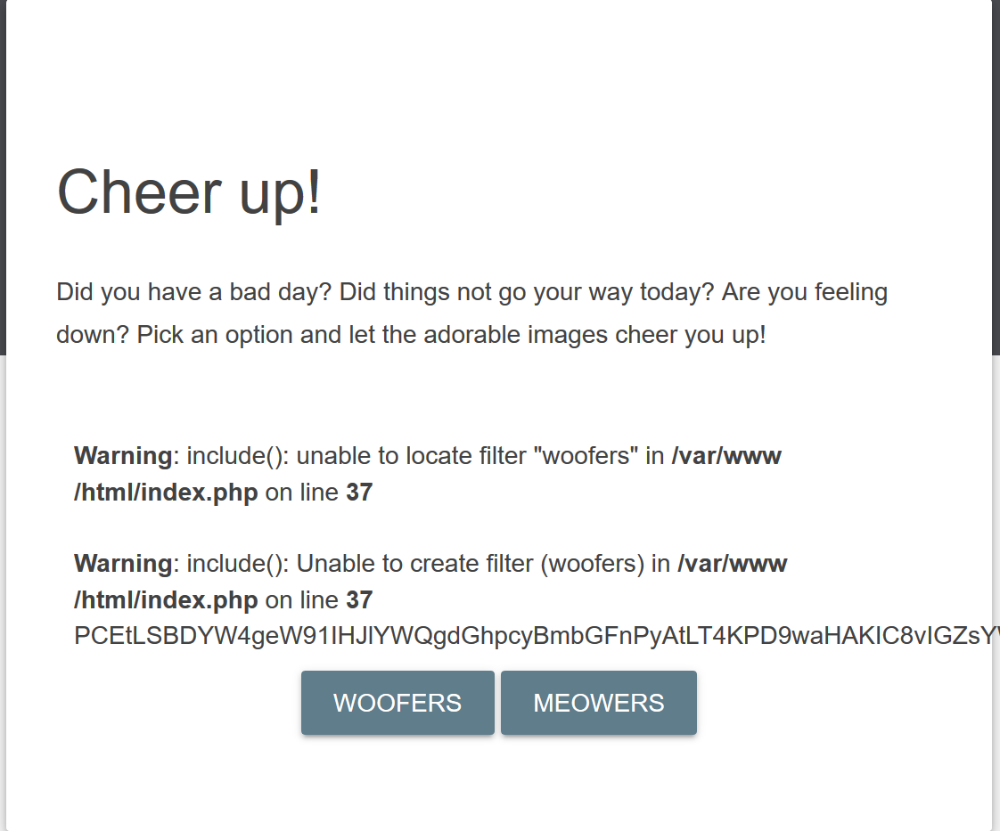

>以为是SQLor xss结果是php://filter

## 1
尝试`?category=xxx`SQL injection语句之后，均出现`xxx.php`不存在的报错信息。都不需要进行爆破了。（需要知道一下源码来理解这种文件后缀名的限制）
所以转向在极客大挑战2019secret file 1里面提到过的`filter`伪协议。

## 2

所以构建payload`?category=php://filter/convert.base64-encode/resource=index`进行test，然后就会发现一片白茫茫。据solution之言，`"woofers" / "index" / "meowers"`这些被过滤了。
官方solution`?category=php://filter/convert.base64-encode/write=woofers/resource=flag`，额外添加了一个`write=woofers`（替换成meowers也行）。

- `?category=php://filter/convert.base64-encode/resource=flag` 主要是用于读取指定路径下的文件（在本例中，指定路径是 flag），并将其进行 Base64 编码后输出。相当于使用 PHP 的 file_get_contents() 函数读取文件内容，并使用 base64_encode() 函数对其进行编码。

- `payload ?category=php://filter/convert.base64-encode/write=woofers/resource=flag` 则是用于读取指定路径下的文件（同样是 flag），并将其内容进行 Base64 编码后写入到另一个文件 woofers 中。相当于使用 PHP 的 file_get_contents() 函数读取文件内容，并使用 base64_encode() 函数对其进行编码，然后使用 file_put_contents() 函数将编码后的内容写入到指定文件中。

- 这两个 payload 的最大区别在于一个是读取指定文件的内容，一个是将指定文件的内容进行编码后写入到另一个文件中。需要根据实际需求来使用适当的操作。
  
## 3

再输入payload之后，界面回显：

如果无法写入 woofers 文件，那么 PHP 脚本将不会执行 file_put_contents() 函数，也就不可能将编码后的文件内容写入到 woofers 文件中。因此，这时候只有将文件内容直接输出（即回显）。也就是可以看到的下面一排base64编码后的“乱码”。

## 4

<a href=https://blog.csdn.net/woshilnp/article/details/117266628>php://filter以及死亡绕过</a>
查看solution还提到了<a href=https://www.invicti.com/learn/local-file-inclusion-lfi/>LFI.</a>。
简单了解一下LFI
>Local File Inclusion，允许恶意黑客访问、查看和/或包含位于文档根文件夹中的 Web 服务器文件系统中的文件。

举例说明：如果应用程序被设计为根据 URL 参数显示任意图像，但攻击者能够使用此功能显示应用程序源代码，则该应用程序具有 LFI 漏洞。注意，如果攻击者可以包含来自远程位置的恶意文件，那么我们说的就是远程文件包含(RFI)漏洞。

### LFI可能出现场景：
- 1.如果应用程序显示任意图像，则可以使用它来显示敏感信息，如源代码或配置文件。

- 2.如果应用程序允许您下载任意文件(如 PDF 文件) ，则可以使用它来下载敏感信息(如源代码或配置文件)。

- 3.如果应用程序包含任意的文件内容作为 HTML 页面的一部分，它可以用来利用跨网站脚本漏洞。

- 4.如果应用程序动态地包含任意源代码文件，并且攻击者能够上传或更改文件，则可以使用该应用程序升级到远程代码执行。