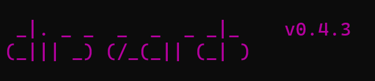

## 0

新英雄登场

下载安装还搞了半天。
主要体现在直接git下载还少了一些模块，记得下载requirements.txt不然没法用。

----
## 1

进去以后是非主流文字如果想看懂可以打开开发者工具看响应内容。
然后我就一筹莫展……有数据库……或许SQL injection？
nonono连子目录都不知道in个毛线的jection。
所以打开wp。

我们用<a href=https://blog.csdn.net/m0_48574718/article/details/129244162>dirsearch扫描文件</a>，发现（按wp的说法）<a href=https://www.phpmyadmin.net/>phpmyadmin</a>这个重要显眼的家伙。进去就是一个服务器界面，免密登录非常贴心。


左看右看其实什么也看不到，这时候会感到绝望。不过都到人服务器里面了，就从内爆破吧。wp说该版本的服务器有一个<a href=https://blog.csdn.net/weixin_44037296/article/details/111039461>漏洞</a>

按漏洞说明大胆尝试
```txt
http://xxx/phpmyadmin/index.php?target=db_sql.php%253f/../../../../../../../../flag
```
一步到位。

----
## 2

<a href=https://blog.csdn.net/SopRomeo/article/details/105536972>参考一下</a>
<a href=https://blog.csdn.net/m0_47418965/article/details/121708917>phpmyadmin漏洞</a>